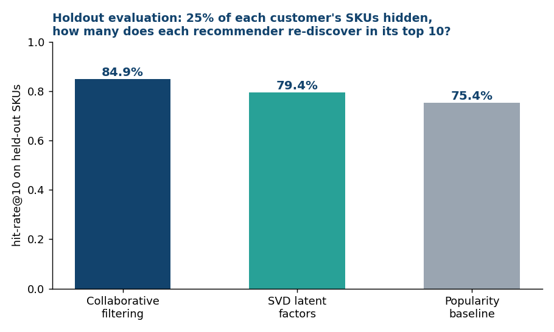
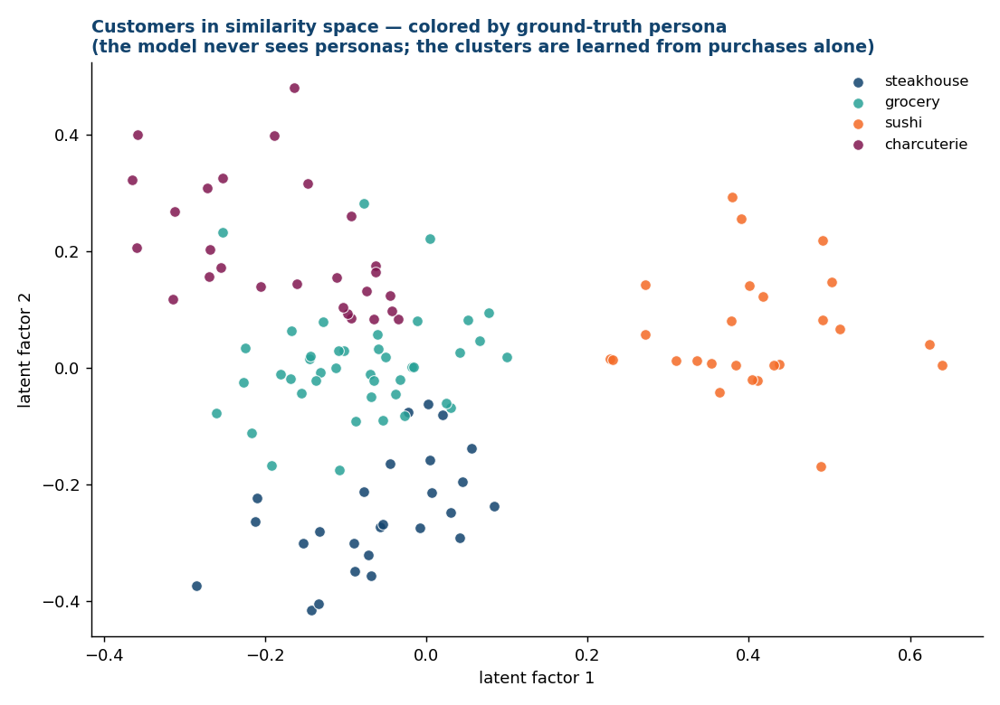
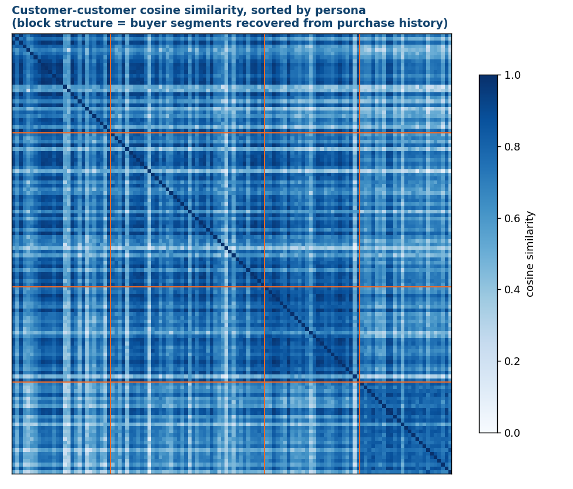

# Customer Recommendation Engine


A B2B cross-sell recommendation engine for a specialty-foods distributor:
item-based collaborative filtering over purchase history, market-basket
affinity ("orders with ahi tuna are 2.4x more likely to include hamachi"),
and revenue-momentum growth targeting — with a **holdout evaluation that
proves the recommender beats a popularity baseline before anyone acts on it**.

## Results (holdout evaluation, hit-rate@10)

For every customer, 25% of their SKUs are hidden, the model is rebuilt
without them, and we measure how many hidden SKUs the engine re-discovers
in its top 10:

| Recommender | Hit-rate@10 | Catalog coverage |
|---|---|---|
| **Collaborative filtering (this engine)** | **84.9%** | **100% of SKUs surfaced** |
| SVD latent factors (matrix factorization) | 79.4% | — |
| Popularity baseline ("suggest the bestsellers") | 75.4% | ~26% by construction |



Neighborhood CF beats both the latent-factor model and the baseline — and
the honest footnote is that popularity is a strong baseline on a 38-SKU
catalog, which is exactly why you measure instead of assuming. Coverage is
the second axis: popularity can only ever recommend the same bestsellers to
everyone, while CF personalizes across the whole catalog. The test suite
enforces `CF > popularity` as a hard invariant: if a code change breaks the
model's edge, CI fails.

## The model, visually

The generator plants four buyer personas; the model never sees them. They
emerge anyway — from purchase quantities alone:





The affinity miner also independently re-discovers the buyer personas
embedded in the data — its strongest pair is **Ahi Tuna Saku + Hamachi Loin
(lift 2.36)**, the sushi-buyer signature — validating the pipeline
end-to-end.

## What it produces

```
output/
├── top_customers.csv              top 10 per region (revenue + cadence)
├── growth_targets.csv             non-top customers ranked by revenue momentum (H2 vs H1)
├── cross_sell_recommendations.csv top-10 white-space SKUs per customer, similarity-scored
├── sku_affinity.csv               SKU pairs with lift >= 1.2 and real support
└── holdout_evaluation.csv         per-customer CF vs popularity hits
```

## How the recommender works

1. **Customer x SKU matrix** of log-damped quantities (log damping stops one
   giant standing order from defining a customer's profile).
2. **Cosine similarity** between customers → each customer's 8 nearest
   neighbors.
3. **White-space scoring**: SKUs the customer has *never* bought, weighted by
   how heavily their neighbors buy them. Never recommends what they already
   buy (test-enforced).
   Every recommendation ships with a **why** (`because_similar_to`: the
   nearest neighbor who buys it) and an **indicative $ opportunity**
   (implied volume x street price) — the two columns that turn a model
   output into something a rep will actually act on.
   **Cold start** is handled explicitly: brand-new customers get a
   region-weighted popularity blend until they have history to learn from.
4. **Basket affinity** (independent check): order-level co-occurrence lift
   with a support floor, so a rep gets pairs that occur often enough to say
   out loud.

## Run it (60 seconds, no setup)

```bash
pip install -r requirements.txt
python data_generator/generate_sales_data.py   # 15k synthetic order lines
python engine/recommend.py                     # all four outputs
python evaluation/evaluate_holdout.py          # CF vs popularity scorecard
pytest tests/ -v                               # 9 invariants
```

## The synthetic data (and why it has structure)

120 customers belong to four buyer personas — steakhouse, grocery, sushi,
charcuterie — each drawing ~80% of order lines from a persona SKU pool and
~20% from the whole catalog. That planted structure is what collaborative
filtering *should* recover, which is what makes the holdout evaluation
meaningful rather than decorative. Fixed seed; no real customers, reps,
suppliers, or prices anywhere in the repo.

## v2 rewrite notes (what changed and why)

This repo began as a scraping-based pipeline (v1, ~2025): top-N revenue
ranking plus Bing searches for "similar businesses" as leads. v2 replaces it
because:

- **Scraping was the weakest link** — fragile against markup changes,
  impossible to test in CI, and rate-limit hostile. The purchase history
  itself carries stronger signal, so the engine now mines that instead.
- **The heavy dependencies were unjustified** — TensorFlow was imported for
  a word-count tokenizer and NLTK for stopwords; v2 is pandas +
  scikit-learn only.
- **v1 had no evaluation** — recommendations you can't score are opinions.
  v2's holdout protocol and CI-enforced baseline comparison are the core of
  the rewrite.
- **The sample data was replaced with a seeded synthetic generator** and the
  original file was purged from git history.

## Repo layout

```
data_generator/   synthetic B2B sales generator (persona-structured, fixed seed)
engine/           recommend.py — CF cross-sell (+why/+$), growth targets,
                  basket affinity, cold-start fallback
evaluation/       holdout protocol: CF vs SVD vs popularity, hit-rate@10 + coverage
analytics/        make_visuals.py — persona map, similarity heatmap, eval chart
tests/            9 invariants: no already-owned recs, symmetric similarity,
                  hand-checked lift math, CF-beats-popularity gate, determinism,
                  cold-start sanity, every rec carries a why
.github/workflows/ CI — regenerates data, runs engine + evaluation + tests
```
