# Customer Recommendation Engine

[](https://github.com/KushPatel29/Customer-Recommendation-Engine/actions/workflows/ci.yml)


The most useful number in this repo is a loss.

The two-stage learned ranker — the architecture every RecSys blog post says
you should build — scored **80.0%** hit-rate@10 on the holdout. Plain
item-neighborhood collaborative filtering scored **84.9%**. So the plain
model ships, the fancy one waits in an A/B slot for real traffic to give it
a second opinion, and the evaluation that produced those numbers runs in CI
on every push so neither of us can quietly forget the result.

This README is the story of how the repo ended up that way. If you just
want to run it, jump to [Run it](#run-it-60-seconds-no-setup).

## Where this started

The first version of this project is about a year and a half old, from my
time doing analytics for a specialty meat distributor. It scraped Bing for
"similar businesses" as leads, imported TensorFlow to run what was
essentially a word counter, and produced recommendations that nobody —
including me — could score. When I came back to it in 2026 I nearly deleted
it. Instead I kept the question it was trying to answer, which is a good
question:

> **A sales rep is about to call a customer. What should they pitch, why,
> and how much is it worth?**

Then I rebuilt everything else under one rule: no claim without a number,
and no number without a test that fails if it stops being true. The rest of
this document is what that rule produced — a recommender, the evaluation
that keeps it honest, the challenger model that lost, the A/B framework
that gives losers a fair hearing, and the four surfaces it all ships on.

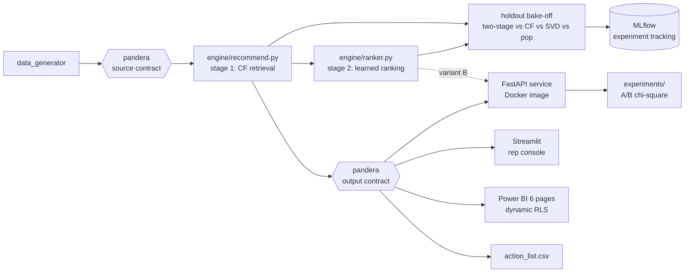

## Step 1 — a model a sales rep can argue with

The engine ([`engine/recommend.py`](engine/recommend.py)) is item-neighborhood
collaborative filtering, chosen on purpose over anything with an embedding:

1. Build a **customer × SKU matrix** of log-damped purchase quantities. The
   log damping matters — without it, one giant standing order defines a
   customer's entire profile.
2. **Cosine similarity** between customers gives each customer their 8
   nearest neighbors.
3. Score **white space**: SKUs the customer has *never* bought, weighted by
   how heavily their neighbors buy them. It never recommends something the
   customer already buys — that's a test, not a promise.

Every recommendation carries two extra columns, and they're the whole point:
a **why** (`because_similar_to` — the nearest neighbor who buys the SKU) and
an **indicative $ opportunity** (implied volume × street price). A rep will
not act on a bare score. A rep will absolutely act on the engine's actual
top opportunity: *pitch Ribeye AAA to Copper Fresh Mart — Quarry Omakase
buys it, and it's worth about $3.3k*.

Two things ride alongside the core model. **Cold start** is handled
explicitly — brand-new customers get a region-weighted popularity blend
until they have history worth learning from. And a **basket-affinity miner**
runs as an independent check: order-level co-occurrence lift with a support
floor, so a rep gets pairs that happen often enough to say out loud
("orders with ahi tuna are 2.4x more likely to include hamachi").

## Step 2 — prove it beats "just suggest the bestsellers"

Recommendations you can't score are opinions. The holdout protocol
([`evaluation/evaluate_holdout.py`](evaluation/evaluate_holdout.py)): hide
25% of every customer's SKUs, rebuild the model without them, and count how
many hidden SKUs each recommender re-discovers in its top 10.

| Recommender | Hit-rate@10 | Catalog coverage |
|---|---|---|
| **Collaborative filtering (this engine)** | **84.9%** | **100% of SKUs surfaced** |
| Two-stage: CF retrieval → gradient-boosted ranker | 80.0% | — |
| SVD latent factors (matrix factorization) | 79.4% | — |
| Popularity baseline ("suggest the bestsellers") | 75.4% | ~26% by construction |


The honest footnote: popularity is a *strong* baseline on a 38-SKU catalog,
which is exactly why you measure instead of assuming. Coverage is the
second axis — popularity can only ever pitch the same bestsellers to
everyone, while CF personalizes across the whole catalog.

Two mechanisms keep this result from decaying into a stale README claim:

- The test suite enforces **CF > popularity as a hard invariant**. If a
  code change breaks the model's edge, CI fails and the change doesn't merge.
- Every evaluation run logs the full bake-off — params (k, holdout fraction,
  n_similar, SVD factors) and metrics — to a local **MLflow** store, so
  model generations accumulate an auditable history:

```bash
mlflow ui --backend-store-uri sqlite:///mlflow.db
```

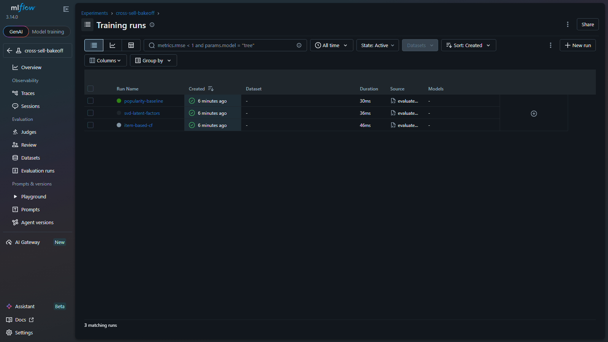

## Step 3 — the architecture upgrade that lost

The production RecSys pattern at catalog scale is **retrieval → ranking**: a
cheap recall-oriented stage fetches candidates, then a learned ranker
re-orders them using features the retriever can't see. I built exactly that
([`engine/ranker.py`](engine/ranker.py)): CF retrieves the top 30 SKUs per
customer, and a gradient-boosted ranker re-scores them on product economics
(margin %, ABC class, repeat-purchase rate) and customer context (RFM, CLV,
recency).

I was fairly sure it would win. To make sure a win would mean something, the
evaluation is leakage-safe twice over: hidden SKUs are the labels, the
candidates come from a matrix that never saw them, and the ranker is scored
**customer-disjoint, 2-fold** — trained on one half of the customers,
graded on the other half, then swapped. It is never graded on labels it
studied.

It lost. 80.0% vs 84.9%. On a 38-SKU catalog the retrieval signal already
saturates, and business features add no repurchase-prediction power on top.
I kept the result, wrote it down, and shipped the simpler model — which is
a better story than the one where the ranker wins, because it's the story
where the evaluation did its job.

## Step 4 — losing offline earns you an A/B slot, not deletion

Here's the tension that makes this interesting: hit-rate@10 measures *"did
they buy it again?"* — it cannot measure *"did the margin-aware ordering
make the business more money?"* The ranker optimizes something the offline
metric is blind to. That's precisely the question online experiments exist
to answer, so instead of deleting the ranker, the serving layer runs it as
variant B.

The pieces ([`experiments/ab_analysis.py`](experiments/ab_analysis.py),
[`api/main.py`](api/main.py)):

- **Sticky assignment.** Every customer hashes to a variant — A is the CF
  champion, B the two-stage challenger — and the variant travels in every
  API response. Same customer, same variant, every time.
- **Telemetry.** Impressions, clicks, and purchases land in an event log
  via `POST /events`.
- **A pre-registered promotion rule.** The analysis script builds the
  conversion contingency table and runs a chi-square test. B gets promoted
  only if `p < 0.05` *and* lift is positive — decided before looking at the
  data, not after. It refuses to conclude anything from fewer than 30
  impressions per variant.
- **Honesty about what this is.** The demo mode (`--simulate 5000`, labeled
  SIMULATION in its output) plants known conversion rates to show the test
  detects a real difference and — just as important — refuses to promote on
  noise. Only real traffic can actually judge the challenger. The framework
  is how it would get a fair hearing.

One more serving-layer detail closes the batch/online gap: a **serve-time
suppressor**. `POST /events` with a purchase updates session state, and the
very next recommendation call excludes the bought SKU and re-closes the
ranks. Batch scores don't know what happened ten seconds ago; the API does.

## Shipping it four ways

A model that only exists in a notebook isn't finished, so this one ships on
four surfaces, all reading the same contract-validated artifacts.

### The API (FastAPI + Docker)

[`api/main.py`](api/main.py) exposes the engine the way a production
recommender is actually consumed: cross-sell scores are **batch-computed**
offline and served fast, while the cold-start endpoint runs **live
inference** per request. OpenAPI docs generate at `/docs`.

```
GET /health                                   service + artifact status
GET /customers?region=&rep=&limit=            ranked book of business
GET /customers/{id}                           profile: segment, churn risk, CLV
GET /customers/{id}/recommendations           top-10 recs with why + $ opportunity
GET /recommendations/cold-start/{region}      LIVE inference for a new customer
GET /affinity?min_lift=                       basket talk tracks
POST /events                                  click/purchase telemetry; purchases
                                              suppress the SKU from the next call
```

The **Dockerfile** bakes generator → engine → analytics into a
self-contained image; CI builds it and smoke-tests `/health` on every push.

```bash
docker build -t rec-api . && docker run -p 8000:8000 rec-api
```

Seven API contract tests (FastAPI `TestClient`) assert the service serves
the batch-scored table verbatim, 404s unknown customers, and returns
monotonically-ranked cold-start results.

### The rep console (Streamlit)

[`app/streamlit_app.py`](app/streamlit_app.py) — pick a customer, get the
whole call plan on one screen: who they are (RFM, churn risk, CLV), what to
pitch (recs with the *because-similar-to* reason and $ opportunity), and
the basket talk tracks. It deliberately defaults to the rep's biggest
**open opportunity**, not their biggest customer.

```bash
streamlit run app/streamlit_app.py
```

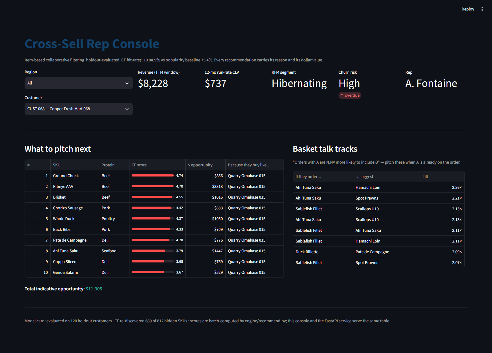

### The dashboard (Power BI, six pages, dynamic RLS)

Hand-authored as a Power BI Project (TMDL + PBIR) in
[`powerbi/pbip/`](powerbi/pbip/), where the ML pipeline's outputs *are* the
semantic model: `customer_analytics.csv` becomes the customer dimension
(segments, churn risk, CLV ride into every visual), `product_analytics.csv`
becomes the product dimension, and the recommender's output becomes a fact
table you can slice by segment.

| Page | What it answers |
|---|---|
| **Sales Overview** | Revenue, margin, orders, MoM growth — by month, region, protein, rep |
| **Sales Team Performance** | Rep leaderboard (revenue/margin/orders/customers), regional trends |
| **Customer Analytics** | Revenue by RFM segment over time, churn-risk exposure, segment slicers |
| **Product Analytics** | Interactive margin-x-revenue scatter by ABC class, protein treemap |
| **Revenue Forecast** | The 8-week ML forecast alongside actuals, with the backtest-winner model named |
| **Recommendations & Actions** | Cross-sell pipeline $ by segment and protein, and the who/what/why action table |

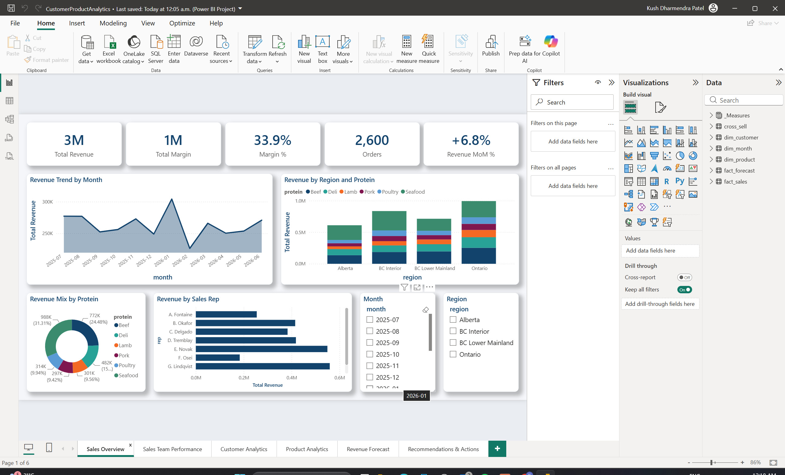

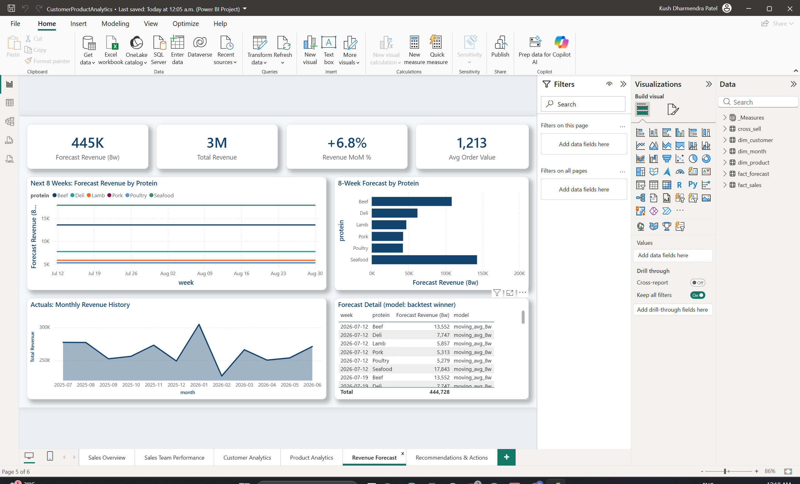

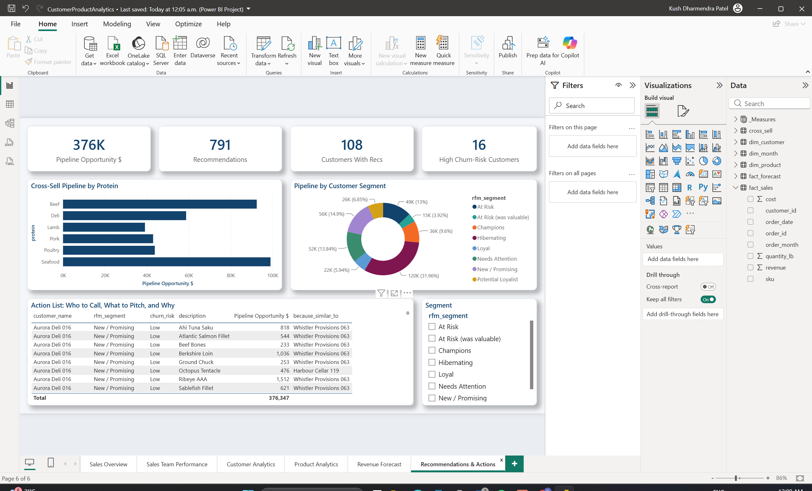

Open `CustomerProductAnalytics.pbip` in Power BI Desktop and hit Refresh
(run the pipeline first so `output/` is populated). Every page carries
slicers and cross-filters, including the recommendation table.

The semantic model also carries two security roles, defined in TMDL
([`roles/`](powerbi/pbip/CustomerProductAnalytics.SemanticModel/definition/roles/)):

- **Sales Rep** (dynamic): `dim_customer[rep] = USERPRINCIPALNAME()` — each
  rep sees only their own book of business, and the filter propagates
  through the relationships so every visual scopes itself automatically.
- **BC Region** (static): the regional-leadership variant.

Verified against the live model via DAX impersonation: no role sees
**120 customers / $3,154,990.62**; the `BC Region` role sees
**59 customers / $1,550,085.42** — matching a pandas cross-check of the
source data to the cent.

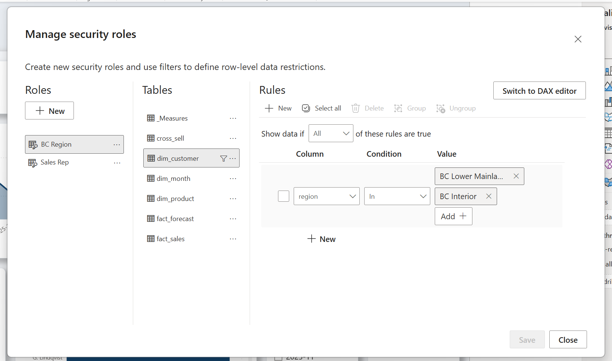

### The flat files

For everything else, `output/` is the interface:

```
output/
├── action_list.csv                THE deliverable: segment + churn risk + CLV +
│                                  best cross-sell (with why and $) per priority customer
├── customer_analytics.csv         per-customer RFM scores/segment, CLV, churn risk, cadence
├── rfm_segment_summary.csv        customers / revenue / avg CLV per segment
├── cohort_retention.csv           monthly cohort x months-since retention matrix
├── product_analytics.csv          per-SKU ABC class, growth, margin %, repeat rate, velocity
├── top_customers.csv              top 10 per region (revenue + cadence)
├── growth_targets.csv             non-top customers ranked by revenue momentum (H2 vs H1)
├── cross_sell_recommendations.csv top-10 white-space SKUs per customer, similarity-scored
├── sku_affinity.csv               SKU pairs with lift >= 1.2 and real support
└── holdout_evaluation.csv         per-customer CF vs SVD vs popularity hits
```

## The analytics around the model

A recommender alone doesn't tell a rep *who* to call or *when*. The
analytics suite fills in the rest of the sentence, and every number is
auditable back to order lines — no black boxes.

**Customer side** ([`analytics/customer_analytics.py`](analytics/customer_analytics.py)):

| Metric | Definition here |
|---|---|
| **RFM segments** | Recency/Frequency/Monetary quintiles mapped to the standard named segments (Champions, Loyal, At Risk, Hibernating, ...) |
| **CLV (12-mo run-rate)** | Annualized margin run-rate, damped by churn risk — labeled a heuristic on purpose |
| **Churn risk** | Days-since-last-order measured against the customer's *own* median reorder cadence — a weekly buyer 3 weeks dark is High risk; a quarterly buyer isn't |
| **Cohort retention** | Monthly first-purchase cohorts x months-since-first (the classic triangle) |

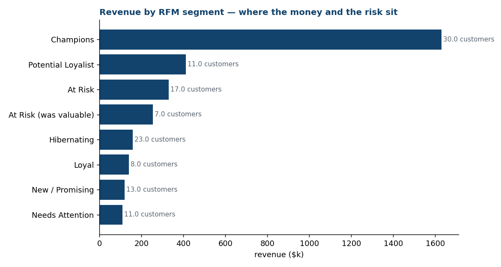

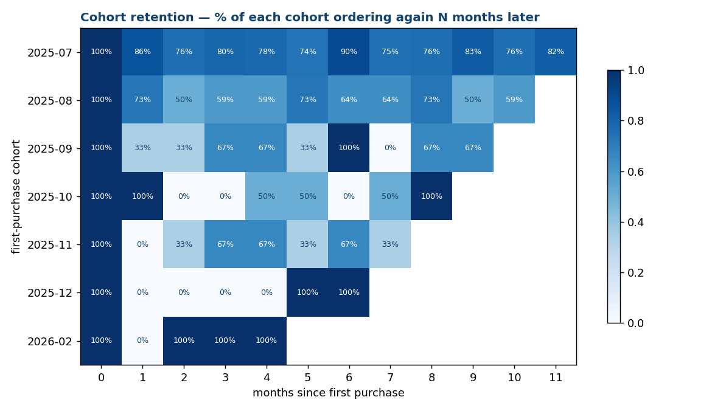

**Product side** ([`analytics/product_analytics.py`](analytics/product_analytics.py)):

| Metric | Definition here |
|---|---|
| **ABC class** | A = SKUs covering the first 80% of revenue, B = next 15%, C = tail |
| **Growth-share quadrant** | Revenue x H2-vs-H1 growth, bubble = margin % — big + declining is the watch list |
| **Repeat purchase rate** | Share of a SKU's buyers who bought it 2+ times (stickiness) |
| **Velocity** | lb/week, for ops and procurement |

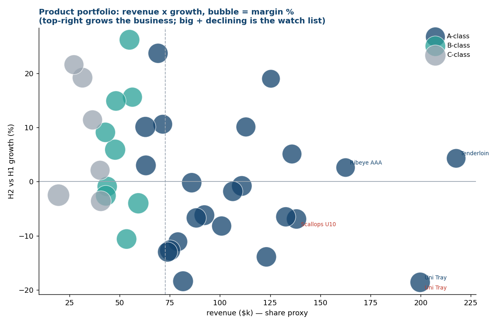

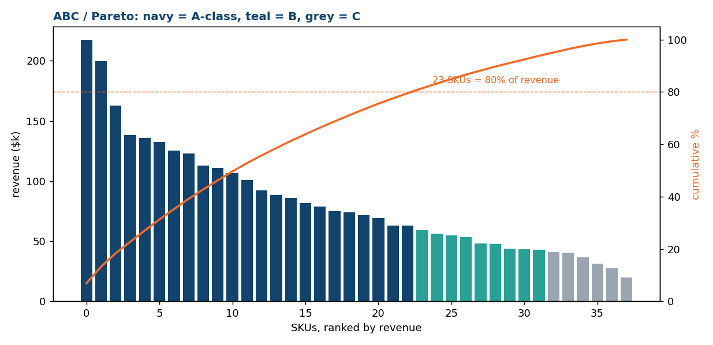

**Forecasting** ([`analytics/revenue_forecast.py`](analytics/revenue_forecast.py))
predicts weekly revenue per protein group 8 weeks ahead. Three models
compete across 3 rolling-origin folds; the moving average wins (22.3% WAPE
vs 23.8% Holt-Winters, 29.9% seasonal naive) — the second time in this repo
a simple model beat a sophisticated one in a fair test, and the CI-tested
rule is the same: beat the naive baseline or ship the baseline.

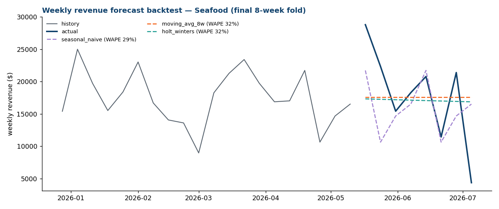

**Validation extras**: K-Means behavioural clustering on the customer × SKU
matrix, validated two ways — silhouette 0.11 (internal) and **Adjusted Rand
Index 0.57** against the generator's ground-truth personas (external) — so
the clustering claim is measured, not asserted. Plus an expected-next-order
date per customer (their own median cadence, with a `days_overdue` column)
and per-SKU dead-stock detection.

### Where it all converges: the action list

`output/action_list.csv` is the artifact a sales manager would actually
distribute on a Monday morning: every priority customer with their segment,
churn risk, CLV, and the single best cross-sell — including *why* and an
indicative $ size. Customers with no white space left are flagged as
retention calls, not dropped. Segmentation says **who** to call, churn risk
says **when**, the recommender says **what to pitch**, and CLV says **in
what order**.

## The model, visually

The data generator plants four buyer personas — steakhouse, grocery, sushi,
charcuterie. The model never sees the labels. They emerge anyway, from
purchase quantities alone:


The affinity miner independently re-discovers the same structure — its
strongest pair is **Ahi Tuna Saku + Hamachi Loin (lift 2.36)**, the
sushi-buyer signature — which validates the pipeline end-to-end.

## Engineering quality gates

- **Data contracts** ([`contracts/schemas.py`](contracts/schemas.py)):
  pandera schemas at both pipeline boundaries — the source contract (IDs
  match `CUST-\d{3}`/`SKU-\d{3}`, quantities positive, **revenue reconciles
  to quantity × price** on every row) and the output contract (ranks 1–10,
  scores positive). CI fails on any violation.
- **Lint + types**: `ruff` (pyflakes, bugbear, import order, pyupgrade) and
  `mypy` over `api/`, `engine/`, `contracts/` as a dedicated CI job;
  [`.pre-commit-config.yaml`](.pre-commit-config.yaml) runs the same checks
  before a commit leaves the machine.
- **33 tests**: engine invariants (never recommend what's owned, symmetric
  similarity, hand-checked lift math, determinism), the CF-beats-popularity
  gate, the data contracts, the API contract tests, and the experimentation
  suite (sticky A/B assignment, serve-time suppression, chi-square detects
  planted differences and refuses to reward noise).
- **Nightly schedule**: CI's cron trigger regenerates the data and re-runs
  the entire pipeline + suite every night — unattended-green as a feature.

## Things I deliberately didn't build

Choices a reviewer should read as intentional, not missing:

- **No cloud warehouse cosplay.** The medallion/warehouse/orchestration
  story lives where it can be *verified*: my
  [dbt + DuckDB/Snowflake repo](https://github.com/KushPatel29/supply-chain-analytics-dbt)
  (staging → marts, incremental models, SCD2, semantic layer, Airflow DAG
  with DagBag CI validation) and the
  [Fabric medallion repo](https://github.com/KushPatel29/supply-chain-control-tower-).
  Duplicating an unrunnable Snowflake config here would add keywords, not
  evidence.
- **Batch scoring + thin serving, not a feature store.** At 120 customers ×
  38 SKUs, precomputing all scores is the correct production shape; the API
  documents that tradeoff and still demonstrates live inference on the
  cold-start path.
- **No FAISS.** Approximate nearest-neighbor search earns its approximation
  error somewhere above ~10^5 vectors; below that, exact brute force is
  both optimal and faster. Wrapping a 120×38 matrix in a vector database
  would be resume-driven infrastructure — knowing *when not to reach for
  ANN* is the production skill. The two-stage pipeline is where this repo
  demonstrates scale-shaped architecture instead.
- **No two-tower network.** The bake-off already contains a latent-factor
  model (SVD), and the neighborhood model *beats it* while staying
  explainable enough to put a "because" column in front of a sales rep.
  Deep learning on a 38-SKU catalog would be the same mistake as FAISS,
  with a GPU bill.

## The synthetic data (and why it has structure)

120 customers belong to four buyer personas, each drawing ~80% of order
lines from a persona SKU pool and ~20% from the whole catalog. That planted
structure is what collaborative filtering *should* recover — it's what
makes the holdout evaluation meaningful rather than decorative. Fixed seed;
no real customers, reps, suppliers, or prices anywhere in the repo. (v1
contained a real sample file; it was purged from git history as part of the
rewrite, which is also why v2 generates its data instead of shipping any.)

## Run it (60 seconds, no setup)

```bash
pip install -r requirements.txt
python data_generator/generate_sales_data.py   # 15k synthetic order lines
python engine/recommend.py                     # recs, growth targets, affinity, cold-start
python analytics/customer_analytics.py         # RFM, CLV, churn, cohorts, action list
python analytics/product_analytics.py          # ABC, portfolio quadrant, repeat rates
python evaluation/evaluate_holdout.py          # the four-model bake-off + MLflow logging
                                               # (needs the analytics outputs — order matters)
python analytics/revenue_forecast.py           # rolling-origin forecast backtest
python analytics/make_visuals.py               # model visuals
python contracts/schemas.py                    # enforce the data contracts
pytest tests/ -v                               # 33 invariants
# optional serving layer:
pip install -r requirements-api.txt
uvicorn api.main:app          # http://127.0.0.1:8000/docs
streamlit run app/streamlit_app.py
```

## What v1 got wrong (kept for the record)

This repo began as a scraping-based pipeline: top-N revenue ranking plus
Bing searches for "similar businesses" as leads. The specific failures the
rewrite answers:

- **Scraping was the weakest link** — fragile against markup changes,
  impossible to test in CI, rate-limit hostile. The purchase history itself
  carries stronger signal, so the engine mines that instead.
- **The dependencies were unjustified** — TensorFlow imported for a
  word-count tokenizer, NLTK for stopwords. v2 is pandas + scikit-learn.
- **There was no evaluation.** This is the failure that shaped v2 most:
  the holdout protocol and the CI-enforced baseline gate are the core of
  the rewrite, and everything else hangs off them.
- **The sample data was real.** Replaced with a seeded synthetic generator;
  the original file was purged from git history.

## Repo layout

```
data_generator/   synthetic B2B sales generator (persona-structured, fixed seed)
engine/           recommend.py — stage 1: CF cross-sell (+why/+$), growth
                  targets, basket affinity, cold-start fallback
                  ranker.py — stage 2: gradient-boosted re-ranker (two-stage)
evaluation/       holdout protocol: two-stage vs CF vs SVD vs popularity,
                  customer-disjoint ranker eval + MLflow logging
experiments/      A/B analysis: chi-square with a pre-registered promotion rule
api/              FastAPI service (batch-scored recs + live cold-start)
app/              Streamlit rep console
contracts/        pandera data contracts (source + output schemas)
analytics/        customer/product analytics, forecasting, visuals
powerbi/          PBIP (TMDL + PBIR) with dynamic RLS roles, screenshots
tests/            33 invariants: engine, CF-beats-popularity gate, contracts,
                  API, experimentation
Dockerfile        self-contained rec-service image (CI-built + smoke-tested)
.github/workflows/ CI — lint+types | pipeline+contracts+tests | docker | nightly cron
```
