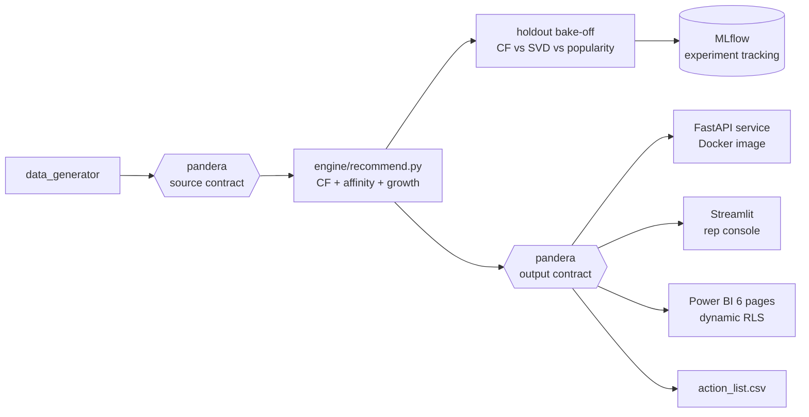

# Customer Recommendation Engine

[](https://github.com/KushPatel29/Customer-Recommendation-Engine/actions/workflows/ci.yml)


A B2B customer & product analytics platform with recommendations at its
core: item-based collaborative filtering over purchase history,
market-basket affinity ("orders with ahi tuna are 2.4x more likely to
include hamachi"), RFM segmentation, run-rate CLV, churn risk, cohort
retention, ABC portfolio analysis — all joined into a rep-ready action
list, with a **holdout evaluation that proves the recommender beats a
popularity baseline before anyone acts on it**.

The model ships four ways, like a production recsys: a **FastAPI service**
(batch-scored recs + live cold-start inference, packaged in **Docker**), a
**Streamlit rep console**, a **6-page Power BI dashboard with dynamic
row-level security**, and CSV artifacts. The bake-off is tracked in
**MLflow**; **pandera contracts** guard both pipeline boundaries; **ruff +
mypy** gate every push; and a **nightly CI run** re-executes the whole
pipeline from a fresh data generation to prove it stays green unattended.



## The serving layer — API, container, console

**FastAPI service** ([`api/main.py`](api/main.py)) exposes the engine the way
a production recommender is actually consumed: cross-sell scores are
**batch-computed** offline and served with low latency, while the cold-start
endpoint runs **live inference** per request (the region-blend fallback for
brand-new customers). OpenAPI docs are auto-generated at `/docs`.

```
GET /health                                   service + artifact status
GET /customers?region=&rep=&limit=            ranked book of business
GET /customers/{id}                           profile: segment, churn risk, CLV
GET /customers/{id}/recommendations           top-10 recs with why + $ opportunity
GET /recommendations/cold-start/{region}      LIVE inference for a new customer
GET /affinity?min_lift=                       basket talk tracks
```

The **Dockerfile** bakes generator → engine → analytics into a
self-contained image; CI builds it and smoke-tests `/health` on every push:

```bash
docker build -t rec-api . && docker run -p 8000:8000 rec-api
```

**Streamlit rep console** ([`app/streamlit_app.py`](app/streamlit_app.py)) —
pick a customer, get the whole call plan on one screen: who they are (RFM,
churn risk, CLV), what to pitch (recs with the *because-similar-to* reason
and $ opportunity), and the basket talk tracks. Runs on the same artifacts
the API serves:

```bash
streamlit run app/streamlit_app.py
```


7 API contract tests (FastAPI `TestClient`) assert the service serves the
batch-scored table verbatim, 404s unknown customers, and returns
monotonically-ranked cold-start results.

## Experiment tracking (MLflow)

Every run of the holdout evaluation logs the three-model bake-off — params
(k, holdout fraction, n_similar, SVD factors) and metrics (hit-rate@10,
catalog coverage, lift over popularity) — to a local MLflow store, so model
generations accumulate an auditable history:

```bash
mlflow ui --backend-store-uri sqlite:///mlflow.db
```


## The interactive dashboard (Power BI)

Everything below converges in a six-page, fully cross-filtering Power BI
dashboard — hand-authored as a Power BI Project (TMDL + PBIR) in
[`powerbi/pbip/`](powerbi/pbip/), where the ML pipeline's outputs *are* the
semantic model: `customer_analytics.csv` becomes the customer dimension
(segments, churn risk, CLV ride straight into every visual),
`product_analytics.csv` becomes the product dimension (ABC class, repeat
rate), and the recommender's output becomes a fact table you can slice by
segment.

| Page | What it answers |
|---|---|
| **Sales Overview** | Revenue, margin, orders, MoM growth — by month, region, protein, rep |
| **Sales Team Performance** | Rep leaderboard (revenue/margin/orders/customers), regional trends |
| **Customer Analytics** | Revenue by RFM segment over time, churn-risk exposure, segment slicers |
| **Product Analytics** | Interactive margin-x-revenue scatter by ABC class, protein treemap |
| **Revenue Forecast** | The 8-week ML forecast alongside actuals, with the backtest-winner model named |
| **Recommendations & Actions** | Cross-sell pipeline $ by segment and protein, and the who/what/why action table |


Open `CustomerProductAnalytics.pbip` in Power BI Desktop and hit Refresh
(run the pipeline scripts first so `output/` is populated). Because
`defaultDrillFilterOtherVisuals` is on and every page carries slicers,
selecting any segment, region, protein, or month cross-filters the page —
including the recommendation table.

### Dynamic row-level security (RLS)

The semantic model carries two security roles, defined in TMDL
([`roles/`](powerbi/pbip/CustomerProductAnalytics.SemanticModel/definition/roles/)):

- **Sales Rep** (dynamic): `dim_customer[rep] = USERPRINCIPALNAME()` — each
  rep sees only their own book of business; the filter propagates through
  the relationships to `fact_sales` and the recommendation table, so every
  visual scopes itself automatically.
- **BC Region** (static): the regional-leadership variant with the filter
  embedded.


Verified against the live model via DAX impersonation: no role sees
**120 customers / $3,154,990.62**; the `BC Region` role sees
**59 customers / $1,550,085.42** — matching a pandas cross-check of the
source data to the cent.

## Revenue forecasting (rolling-origin backtest)

`analytics/revenue_forecast.py` forecasts weekly revenue per protein group
8 weeks ahead. Three models compete across 3 rolling folds; the moving
average wins (22.3% WAPE vs 23.8% Holt-Winters, 29.9% seasonal naive) and
the CI-tested rule is "beat the naive baseline or ship the baseline."


## Data-science validation metrics

- **K-Means behavioural clustering** on the customer x SKU matrix, validated
  two ways: silhouette 0.11 (internal) and **Adjusted Rand Index 0.57**
  against the generator's ground-truth personas (external) — the clustering
  claim is measured, not asserted.
- **Expected next order** per customer (last order + their own median
  cadence) with a `days_overdue` column — the practical churn trigger.
- **Dead-stock detection** per SKU (no sale in 30+ days).

## Results (holdout evaluation, hit-rate@10)

For every customer, 25% of their SKUs are hidden, the model is rebuilt
without them, and we measure how many hidden SKUs the engine re-discovers
in its top 10:

| Recommender | Hit-rate@10 | Catalog coverage |
|---|---|---|
| **Collaborative filtering (this engine)** | **84.9%** | **100% of SKUs surfaced** |
| SVD latent factors (matrix factorization) | 79.4% | — |
| Popularity baseline ("suggest the bestsellers") | 75.4% | ~26% by construction |


Neighborhood CF beats both the latent-factor model and the baseline — and
the honest footnote is that popularity is a strong baseline on a 38-SKU
catalog, which is exactly why you measure instead of assuming. Coverage is
the second axis: popularity can only ever recommend the same bestsellers to
everyone, while CF personalizes across the whole catalog. The test suite
enforces `CF > popularity` as a hard invariant: if a code change breaks the
model's edge, CI fails.

## The model, visually

The generator plants four buyer personas; the model never sees them. They
emerge anyway — from purchase quantities alone:


The affinity miner also independently re-discovers the buyer personas
embedded in the data — its strongest pair is **Ahi Tuna Saku + Hamachi Loin
(lift 2.36)**, the sushi-buyer signature — validating the pipeline
end-to-end.

## What it produces

```
output/
├── action_list.csv                THE deliverable: segment + churn risk + CLV +
│                                  best cross-sell (with why and $) per priority customer
├── customer_analytics.csv         per-customer RFM scores/segment, CLV, churn risk, cadence
├── rfm_segment_summary.csv        customers / revenue / avg CLV per segment
├── cohort_retention.csv           monthly cohort x months-since retention matrix
├── product_analytics.csv          per-SKU ABC class, growth, margin %, repeat rate, velocity
├── top_customers.csv              top 10 per region (revenue + cadence)
├── growth_targets.csv             non-top customers ranked by revenue momentum (H2 vs H1)
├── cross_sell_recommendations.csv top-10 white-space SKUs per customer, similarity-scored
├── sku_affinity.csv               SKU pairs with lift >= 1.2 and real support
└── holdout_evaluation.csv         per-customer CF vs SVD vs popularity hits
```

## Customer analytics

The KPI suite a commercial team standardizes on, computed transparently
(no black boxes — every number is auditable back to order lines):

| Metric | Definition here |
|---|---|
| **RFM segments** | Recency/Frequency/Monetary quintiles mapped to the standard named segments (Champions, Loyal, At Risk, Hibernating, ...) |
| **CLV (12-mo run-rate)** | Annualized margin run-rate, damped by churn risk — labeled a heuristic on purpose |
| **Churn risk** | Days-since-last-order measured against the customer's *own* median reorder cadence — a weekly buyer 3 weeks dark is High risk; a quarterly buyer isn't |
| **Cohort retention** | Monthly first-purchase cohorts x months-since-first (the classic triangle) |


## Product analytics

| Metric | Definition here |
|---|---|
| **ABC class** | A = SKUs covering the first 80% of revenue, B = next 15%, C = tail |
| **Growth-share quadrant** | Revenue x H2-vs-H1 growth, bubble = margin % — big + declining is the watch list |
| **Repeat purchase rate** | Share of a SKU's buyers who bought it 2+ times (stickiness) |
| **Velocity** | lb/week, for ops and procurement |


## The action list — where it all converges

`output/action_list.csv` is the artifact a sales manager would actually
distribute on Monday morning: every priority customer (Champions, Loyal,
Potential Loyalist, At Risk) with their segment, churn risk, CLV, and the
single best cross-sell — including *why* ("because <similar customer> buys
it") and an indicative $ size. Customers with no white-space left are
flagged as retention calls, not dropped. Segmentation says **who** to call,
churn risk says **when**, the recommender says **what to pitch**, and CLV
says **in what order**.

## How the recommender works

1. **Customer x SKU matrix** of log-damped quantities (log damping stops one
   giant standing order from defining a customer's profile).
2. **Cosine similarity** between customers → each customer's 8 nearest
   neighbors.
3. **White-space scoring**: SKUs the customer has *never* bought, weighted by
   how heavily their neighbors buy them. Never recommends what they already
   buy (test-enforced).
   Every recommendation ships with a **why** (`because_similar_to`: the
   nearest neighbor who buys it) and an **indicative $ opportunity**
   (implied volume x street price) — the two columns that turn a model
   output into something a rep will actually act on.
   **Cold start** is handled explicitly: brand-new customers get a
   region-weighted popularity blend until they have history to learn from.
4. **Basket affinity** (independent check): order-level co-occurrence lift
   with a support floor, so a rep gets pairs that occur often enough to say
   out loud.

## Engineering quality gates

- **Data contracts** ([`contracts/schemas.py`](contracts/schemas.py)):
  pandera schemas at both pipeline boundaries — the source contract (IDs
  match `CUST-\d{3}`/`SKU-\d{3}`, quantities positive, **revenue reconciles
  to quantity x price** on every row) and the output contract (ranks 1–10,
  scores positive). CI fails on any violation.
- **Lint + types**: `ruff` (pyflakes, bugbear, import order, pyupgrade) and
  `mypy` over `api/`, `engine/`, `contracts/` run as a dedicated CI job;
  [`.pre-commit-config.yaml`](.pre-commit-config.yaml) runs the same checks
  locally before a commit leaves the machine.
- **26 tests**: engine invariants (never recommend what's owned, symmetric
  similarity, hand-checked lift math, determinism), the **CF-beats-popularity
  gate**, data contracts, and the 7 API contract tests.
- **Nightly schedule**: CI's cron trigger regenerates the data and re-runs
  the entire pipeline + suite every night — unattended-green as a feature.

## Run it (60 seconds, no setup)

```bash
pip install -r requirements.txt
python data_generator/generate_sales_data.py   # 15k synthetic order lines
python engine/recommend.py                     # all four outputs
python evaluation/evaluate_holdout.py          # CF vs SVD vs popularity + MLflow logging
python analytics/customer_analytics.py         # RFM, CLV, churn, cohorts, action list
python analytics/product_analytics.py          # ABC, portfolio quadrant, repeat rates
python analytics/make_visuals.py               # model visuals
python contracts/schemas.py                    # enforce the data contracts
pytest tests/ -v                               # 26 invariants
# optional serving layer:
pip install -r requirements-api.txt
uvicorn api.main:app          # http://127.0.0.1:8000/docs
streamlit run app/streamlit_app.py
```

## Deliberate architecture choices (what this repo does NOT fake)

Choices a reviewer should read as intentional, not missing:

- **No cloud warehouse cosplay.** The medallion/warehouse/orchestration story
  lives where it can be *verified*: my
  [dbt + DuckDB/Snowflake repo](https://github.com/KushPatel29/supply-chain-analytics-dbt)
  (staging → marts, incremental models, SCD2, semantic layer, Airflow DAG
  with DagBag CI validation) and the
  [Fabric medallion repo](https://github.com/KushPatel29/supply-chain-control-tower-).
  Duplicating an unrunnable Snowflake config here would add keywords, not
  evidence.
- **Batch scoring + thin serving, not a feature store.** At 120 customers x
  38 SKUs, precomputing all scores is the correct production shape; the API
  documents that tradeoff and still demonstrates live inference on the
  cold-start path.
- **Neighborhood CF over a two-tower network.** The bake-off already contains
  a latent-factor model (SVD) — and the neighborhood model *beats it* while
  staying explainable enough to put a "because" column in front of a sales
  rep. Reaching for deep learning on a 38-SKU catalog would be
  resume-driven engineering; the discipline worth showing is the measured
  comparison and the gate that ships the winner.

## The synthetic data (and why it has structure)

120 customers belong to four buyer personas — steakhouse, grocery, sushi,
charcuterie — each drawing ~80% of order lines from a persona SKU pool and
~20% from the whole catalog. That planted structure is what collaborative
filtering *should* recover, which is what makes the holdout evaluation
meaningful rather than decorative. Fixed seed; no real customers, reps,
suppliers, or prices anywhere in the repo.

## v2 rewrite notes (what changed and why)

This repo began as a scraping-based pipeline (v1, ~2025): top-N revenue
ranking plus Bing searches for "similar businesses" as leads. v2 replaces it
because:

- **Scraping was the weakest link** — fragile against markup changes,
  impossible to test in CI, and rate-limit hostile. The purchase history
  itself carries stronger signal, so the engine now mines that instead.
- **The heavy dependencies were unjustified** — TensorFlow was imported for
  a word-count tokenizer and NLTK for stopwords; v2 is pandas +
  scikit-learn only.
- **v1 had no evaluation** — recommendations you can't score are opinions.
  v2's holdout protocol and CI-enforced baseline comparison are the core of
  the rewrite.
- **The sample data was replaced with a seeded synthetic generator** and the
  original file was purged from git history.

## Repo layout

```
data_generator/   synthetic B2B sales generator (persona-structured, fixed seed)
engine/           recommend.py — CF cross-sell (+why/+$), growth targets,
                  basket affinity, cold-start fallback
evaluation/       holdout protocol: CF vs SVD vs popularity + MLflow logging
api/              FastAPI service (batch-scored recs + live cold-start)
app/              Streamlit rep console
contracts/        pandera data contracts (source + output schemas)
analytics/        customer/product analytics, forecasting, visuals
powerbi/          PBIP (TMDL + PBIR) with dynamic RLS roles, screenshots
tests/            26 invariants: engine, CF-beats-popularity gate, contracts, API
Dockerfile        self-contained rec-service image (CI-built + smoke-tested)
.github/workflows/ CI — lint+types | pipeline+contracts+tests | docker | nightly cron
```
